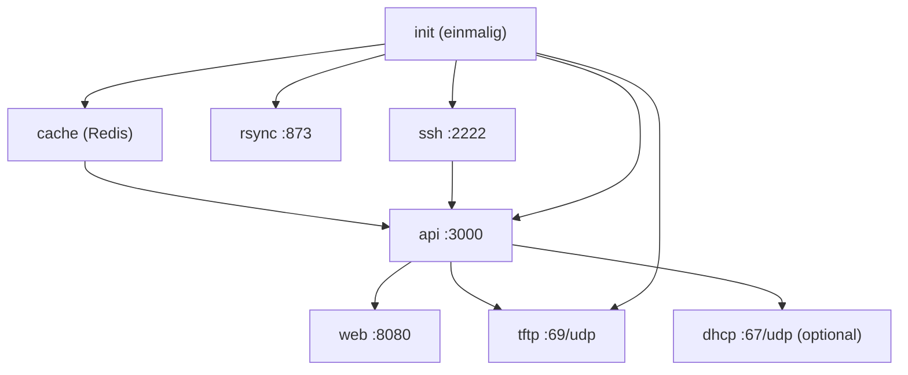
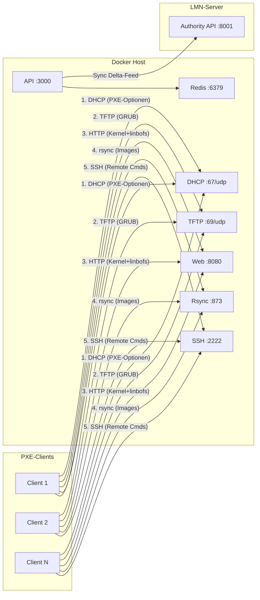

<objective>
Create the admin guide (docs/ADMIN-GUIDE.md) covering container architecture, network diagram with firewall rules, and operational reference.

Purpose: DOC-02 requires an architecture overview explaining container roles, ports, volumes, and startup order. DOC-03 requires a network diagram showing all connections with port numbers and firewall rules. Per user decision, both are combined in a single ADMIN-GUIDE.md document with Mermaid diagrams, deep design explanations, and a full DHCP section.

Output: docs/ADMIN-GUIDE.md (new)
</objective>

<execution_context>
@/root/.claude/get-shit-done/workflows/execute-plan.md
@/root/.claude/get-shit-done/templates/summary.md
</execution_context>

<context>
@.planning/PROJECT.md
@.planning/ROADMAP.md
@.planning/STATE.md
@.planning/phases/12-admin-documentation/12-CONTEXT.md
@.planning/phases/12-admin-documentation/12-RESEARCH.md

Source files for accurate documentation:
@docker-compose.yml
@setup.sh
@scripts/doctor.sh
@scripts/wait-ready.sh
@Makefile
@.env.example
@docs/ARCHITECTURE.md
@docs/hooks.md
@docs/UNTERSCHIEDE-ZU-LINBO.md
@containers/dhcp/entrypoint.sh
</context>

<tasks>

<task type="auto">
  <name>Task 1: Create docs/ADMIN-GUIDE.md — Architecture, Network Diagram, Firewall</name>
  <files>docs/ADMIN-GUIDE.md</files>
  <action>
Create `docs/ADMIN-GUIDE.md` in German prose with English technical terms. This is a REFERENCE document (not procedural like INSTALL.md) — sections can be read independently.

**Structure (follow this section order exactly):**

**1. Ueberblick**
- Was ist LINBO Docker: containerisierte Version von LINBO fuer PXE Network Boot
- Warum Docker: Isolation, Reproduzierbarkeit, kein Eingriff ins Host-System
- Read-Only-Prinzip: Docker schreibt NIEMALS Hosts/Configs/Rooms zurueck zum LMN-Server. Alle CRUD-Operationen geschehen auf dem LMN-Server (webui7/linuxmuster-import-devices). Docker konsumiert via Authority API Delta-Feed.
- Link to INSTALL.md fuer Installation, link to UNTERSCHIEDE-ZU-LINBO.md fuer Vergleich

**2. Container-Architektur**

Markdown-Tabelle mit allen 8 Containern. Cross-reference EVERY value against docker-compose.yml:

| Container | Port | Netzwerk-Modus | Rolle | Resource Limits |
|-----------|------|----------------|-------|-----------------|
| init | — | bridge | Boot-Dateien herunterladen und extrahieren (einmalig) | 2.0 CPU, 512M |
| tftp | 69/udp | host | PXE-Boot via TFTP (GRUB-Dateien) | 0.5 CPU, 64M |
| rsync | 873/tcp | bridge (port mapping) | Image- und Config-Synchronisation | 2.0 CPU, 256M |
| ssh | 2222/tcp | bridge (port mapping) | SSH-Server fuer Remote-Befehle an LINBO-Clients | 0.5 CPU, 128M |
| cache | 6379/tcp | bridge (port mapping) | Redis — Cache, Host-Status, Operations, Settings | 1.0 CPU, 256M |
| api | 3000/tcp | bridge (port mapping) | REST API + WebSocket (Express.js) | 2.0 CPU, 512M |
| web | 8080->80/tcp | bridge (port mapping) | React SPA + HTTP Boot (Nginx) | 1.0 CPU, 128M |
| dhcp | 67/udp | host | dnsmasq Proxy-DHCP (optional, `--profile dhcp`) | 0.5 CPU, 64M |

**Startup-Reihenfolge** — Mermaid diagram showing dependency DAG:


Explain dependency conditions from docker-compose.yml:
- init: `service_completed_successfully` (must finish before most others)
- cache: `service_healthy` (redis-cli ping)
- ssh: `service_started` (API needs it started, not necessarily healthy)
- api: `service_healthy` (curl health endpoint — web and dhcp depend on this)

**Health Checks** — brief table:

| Container | Check | Interval | Start Period |
|-----------|-------|----------|-------------|
| cache | redis-cli ping | 10s | — |
| api | curl localhost:3000/health | 10s | 60s |
| web | curl localhost/health | 10s | 30s |
| tftp | pgrep in.tftpd | 30s | — |
| rsync | pgrep rsync | 30s | — |
| ssh | pgrep sshd | 30s | — |

**3. Volumes**

| Volume | Pfad im Container | Inhalt | Backup-relevant? |
|--------|-------------------|--------|------------------|
| linbo_srv_data | /srv/linbo | Boot-Dateien, Images, GRUB-Configs, linbocmd | JA (Images!) |
| linbo_config | /etc/linuxmuster/linbo | SSH-Keys, start.conf Templates | JA (Keys!) |
| linbo_log | /var/log/linuxmuster/linbo | API Logs | Nein |
| linbo_redis_data | /data (cache) | Redis Persistenz | Nein (Cache) |
| linbo_kernel_data | /var/lib/linuxmuster/linbo | Kernel-Varianten (.deb Pakete) | Nein (re-downloadbar) |
| linbo_driver_data | /var/lib/linbo/drivers | Patchclass Treiber-Sets | JA (wenn Patchclass genutzt) |

Note: `./themes` und `./scripts/server` sind Bind-Mounts aus dem Git-Repo, keine Docker Volumes.

**4. Netzwerk-Diagramm (DOC-03)**

Full deployment Mermaid diagram showing: LMN Server + Docker Host + PXE Clients + Network Segments.

Use `graph LR` (left-to-right) for network topology. Follow existing ARCHITECTURE.md Mermaid style (subgraphs, color scheme: blue for API, red for Redis, green for web).



(Adjust the exact Mermaid syntax as needed for readability — the key point is that ALL connections are visible with port numbers and protocols.)

**Firewall-Regeln** — Two tables (inbound + outbound), cross-referenced against RESEARCH.md verified data:

**Eingehend (von PXE-Clients zum Docker Host):**

| Port | Protokoll | Richtung | Dienst | Anmerkung |
|------|-----------|----------|--------|-----------|
| 69 | UDP | Client -> Docker | TFTP | PXE-Boot (GRUB-Dateien). Host-Network-Modus. |
| 873 | TCP | Client -> Docker | rsync | Image- und Config-Synchronisation. |
| 2222 | TCP | Docker -> Client | SSH | Dropbear (Remote-Befehle: sync, start, reboot). Server initiiert Verbindung zum Client. |
| 8080 | TCP | Browser -> Docker | Web UI | Nginx + React SPA. Konfigurierbar via WEB_PORT. |
| 3000 | TCP | Intern | API | REST API + WebSocket. Normalerweise nur vom Web-Container, nicht von Clients. |
| 6379 | TCP | Intern | Redis | Nur extern noetig bei verteilten DC-Worker-Deployments. |
| 67 | UDP | Client -> Docker | DHCP | Nur mit `--profile dhcp`. Host-Network-Modus. |

**Ausgehend (vom Docker Host):**

| Port | Protokoll | Richtung | Dienst | Anmerkung |
|------|-----------|----------|--------|-----------|
| 443 | TCP | Docker -> Internet | HTTPS | deb.linuxmuster.net (Init-Container), GitHub (npm Packages) |
| 8001 | TCP | Docker -> LMN | linuxmuster-api | Sync-Modus (LMN_API_URL). Alternativ Port 8400 fuer Authority API. |

**Important:** Note that SSH port 2222 direction is Docker-to-Client (the API sends commands TO clients via SSH, not the other way around). Also note that TFTP uses host network mode (the firewall rule applies to the host directly, not through Docker NAT).

**5. DHCP-Konfiguration (Detail)**
- Wann Proxy-DHCP nutzen vs bestehenden DHCP konfigurieren:
  - Proxy-DHCP: einfacher, kein bestehender DHCP muss geaendert werden, funktioniert parallel
  - Bestehender DHCP: wenn Admin volle Kontrolle will, kein zusaetzlicher Container
- ISC DHCP snippet (BIOS + UEFI) — use exact same snippet from INSTALL.md (consistency)
- dnsmasq snippet — use exact same snippet from INSTALL.md
- Proxy-DHCP Container Details:
  - Startet mit `docker compose --profile dhcp up -d`
  - Konfiguration: DHCP_INTERFACE, LINBO_SERVER_IP in .env
  - Container nutzt host network mode + NET_ADMIN + NET_RAW capabilities
  - Generiert dnsmasq.conf automatisch basierend auf .env
- BIOS vs UEFI Boot-Dateien: `boot/grub/i386-pc/core.0` (BIOS), `boot/grub/x86_64-efi/core.efi` (UEFI)

**6. Design-Entscheidungen**
Deep explanations per user decision:
- **Warum Read-Only:** Docker darf LMN-Daten niemals veraendern. Alle CRUD-Operationen geschehen auf dem LMN-Server. Docker konsumiert via Cursor-basiertem Delta-Feed. Erklaere warum: Datenkonsistenz, kein Split-Brain, LMN bleibt Source of Truth.
- **Warum Hooks statt Patches:** linbofs64 wird nicht direkt modifiziert. Stattdessen Hook-System in update-linbofs.sh (pre/post hooks). Erklaere warum: upstream-kompatibel bleiben, LINBO-Updates ohne Merge-Konflikte, Anpassungen sind modular. Link to docs/hooks.md.
- **Warum Docker:** Isolation (keine Systemabhaengigkeiten), Reproduzierbarkeit (identische Builds), Portabilitaet (laeuft auf jedem Linux mit Docker). Erklaere: traditionelle LMN-Installation benoetigt spezifische Ubuntu-Version + Samba + LDAP. Docker braucht nur Docker.
- **Warum Package-Kernel:** Docker nutzt den Kernel aus dem linbo7-Paket (kernel.org stable/longterm/legacy), nicht den Host-Kernel. Erklaere warum: Reproduzierbarkeit (gleicher Kernel auf allen Deployments), keine Host-Kernel-Abhaengigkeit, Kernel-Wechsel via API moeglich.

**7. Betrieb & Wartung**

**Makefile-Targets** — Tabelle mit allen admin-relevanten Targets (aus RESEARCH.md verifiziert):

| Kommando | Beschreibung |
|----------|-------------|
| `make up` | Alle Container starten |
| `make down` | Alle Container stoppen |
| `make rebuild` | API + Web neu bauen |
| `make rebuild-all` | Alle Container neu bauen |
| `make logs` | API-Logs anzeigen (tail -f) |
| `make logs-all` | Alle Logs anzeigen |
| `make health` | Health-Check (API + Web) |
| `make wait-ready` | Blockiert bis alle Container bereit |
| `make doctor` | 24 Diagnose-Checks in 6 Kategorien |
| `make test` | Test-Suite ausfuehren |
| `make status` | Git + Docker Status |
| `make clean` | Docker Builder + Image Cache leeren |

**Log-Zugriff:**
- `docker logs linbo-api --tail 50 -f` — API-Container Logs
- `docker compose logs --tail 20 -f` — Alle Container
- Persistent logs: `linbo_log` Volume (`/var/log/linuxmuster/linbo`)

**Update-Prozedur:**
```bash
cd linbo-docker
git pull
docker compose up -d --build
make wait-ready
make doctor
```

**Anpassungen via Hooks:**
- Kurze Erklaerung des Hook-Systems
- Verzeichnisse: `/etc/linuxmuster/linbo/hooks/update-linbofs.pre.d/` und `.post.d/`
- Beispiel: Plymouth-Theme Hook (01_edulution-plymouth)
- Link to docs/hooks.md fuer Details

**8. Weiterfuehrende Dokumentation**
- [docs/INSTALL.md](INSTALL.md) — Installationsanleitung
- [docs/TROUBLESHOOTING.md](TROUBLESHOOTING.md) — Ausfuehrliche Fehlerdiagnose
- [docs/hooks.md](hooks.md) — Hook-System fuer linbofs64-Anpassungen
- [docs/UNTERSCHIEDE-ZU-LINBO.md](UNTERSCHIEDE-ZU-LINBO.md) — Vergleich Docker vs Vanilla LINBO
- [docs/ARCHITECTURE.md](ARCHITECTURE.md) — Entwickler-Referenz (Mermaid-Diagramme)

**Writing rules:**
- German prose with English technical terms
- Every port number, volume name, and resource limit MUST be verified against docker-compose.yml
- Mermaid diagrams following existing ARCHITECTURE.md style (graph TB/LR, subgraph, color scheme)
- This is REFERENCE documentation — sections should work independently (admin can jump to "Firewall" without reading "Container-Architektur" first)
- ARCHITECTURE.md stays UNTOUCHED (developer reference) — this is the ADMIN version
- No standalone mode details (sync mode only per user decision)
  </action>
  <verify>
    <automated>test -f docs/ADMIN-GUIDE.md && grep -c "mermaid" docs/ADMIN-GUIDE.md | awk '{if ($1 >= 2) print "OK: "$1" mermaid blocks"; else print "FAIL: only "$1" mermaid blocks"}' && wc -l docs/ADMIN-GUIDE.md | awk '{if ($1 >= 300) print "OK: "$1" lines"; else print "FAIL: only "$1" lines"}'</automated>
  </verify>
  <done>docs/ADMIN-GUIDE.md exists with 300+ lines, contains at least 2 Mermaid diagrams (startup dependency DAG + network topology), has firewall tables (inbound + outbound), container architecture table with all 8 containers, volume table, design rationale section, and Makefile reference table — all values verified against docker-compose.yml</done>
</task>

</tasks>

<verification>
- docs/ADMIN-GUIDE.md contains Mermaid diagrams (startup order + network topology)
- Firewall table lists all 7 inbound ports (69, 873, 2222, 8080, 3000, 6379, 67) and 2+ outbound ports (443, 8001)
- Container table matches docker-compose.yml for all 8 services (ports, network modes, resource limits)
- Volume table covers all 6 named volumes from docker-compose.yml
- Design rationale section explains read-only, hooks, Docker, and package kernel
- Cross-links to INSTALL.md, hooks.md, TROUBLESHOOTING.md, UNTERSCHIEDE-ZU-LINBO.md present
</verification>

<success_criteria>
- docs/ADMIN-GUIDE.md is a comprehensive admin reference (300+ lines) covering architecture, network, firewall, DHCP, design rationale, and operations
- All port numbers, volume names, and resource limits match docker-compose.yml exactly
- Mermaid diagrams render correctly (valid syntax, subgraphs with labels, connections with port numbers)
- Language is German prose with English technical terms throughout
- An admin who has never seen the codebase can configure their firewall correctly using only this document
</success_criteria>

<output>
After completion, create `.planning/phases/12-admin-documentation/12-02-SUMMARY.md`
</output>
