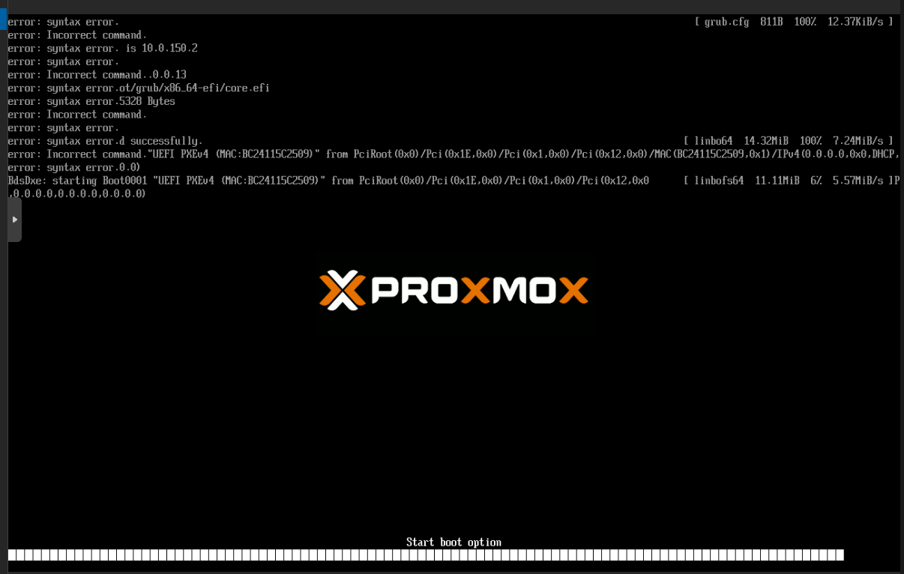

# LINBO Docker

**Standalone Docker-based Network Boot & Imaging Solution**

[](https://github.com/amolani/linbo-docker/actions/workflows/update-boot-files.yml)

LINBO Docker is a containerized version of [LINBO](https://github.com/linuxmuster/linuxmuster-linbo7) (Linux Network Boot) that runs independently without requiring a full linuxmuster.net installation. It achieves ~97% functional parity with the production linuxmuster.net 7.3 stack.



## Features

- **Web Interface** - Modern React-based management UI with dark theme
- **PXE Network Boot** - Boot clients over the network via TFTP + HTTP
- **HTTP Boot** - Kernel/initrd served via HTTP for 5-10x faster transfers than TFTP
- **Image Management** - Create, sync, and deploy disk images (qcow2)
- **Remote Control** - Execute commands on clients via SSH (sync, start, reboot, shutdown, WoL)
- **REST API** - Full REST API with JWT authentication and API key support
- **Real-time Updates** - WebSocket for live status updates
- **DHCP Integration** - Export ISC DHCP / dnsmasq configs, optional proxy-DHCP container
- **Host Provisioning** - Automatic AD/DNS provisioning via DC Worker on Domain Controller
- **Machine Account Repair** - Automated macct repair via Redis Streams + DC Worker
- **Device Import/Export** - CSV import/export compatible with linuxmuster.net format
- **Config Deployment** - Automatic start.conf deployment with IP-symlinks
- **GRUB Automation** - Auto-generated boot configs per config/host (symlinks)
- **Background Operations** - Async operation worker for batch commands
- **Auto-Updates** - Boot files automatically updated via GitHub Actions
- **Standalone** - No linuxmuster.net server required

## Quick Start

### Prerequisites

- Docker Engine 24.0+
- Docker Compose v2.20+
- 4 GB RAM minimum
- 50 GB disk space (more for images)

### Installation

```bash
# Clone the repository
git clone https://github.com/amolani/linbo-docker.git
cd linbo-docker

# Copy and configure environment
cp .env.example .env
nano .env  # Set your LINBO_SERVER_IP, passwords, etc.

# Start all services
docker compose up -d

# Check status
docker compose ps
```

On first start, the init container automatically downloads the LINBO boot files (~70 MB) from GitHub Releases.

### Create Admin User

```bash
docker exec linbo-api node -e "
const bcrypt = require('bcryptjs');
const { PrismaClient } = require('@prisma/client');
const prisma = new PrismaClient();
bcrypt.hash('admin', 10).then(hash => {
  prisma.user.upsert({
    where: { username: 'admin' },
    update: { passwordHash: hash },
    create: { username: 'admin', passwordHash: hash, role: 'admin' }
  }).then(() => { console.log('Admin user created'); process.exit(0); });
});
"
```

### Verify Installation

```bash
# Health check
curl http://localhost:3000/health

# Login
curl -X POST http://localhost:3000/api/v1/auth/login \
  -H "Content-Type: application/json" \
  -d '{"username":"admin","password":"admin"}'
```

### Access Web Interface

Open **http://localhost:8080** in your browser.

## Architecture

```
                            Docker Host
 ┌─────────────────────────────────────────────────────────────┐
 │                                                             │
 │  ┌──────────────────────────────────────────────────────┐   │
 │  │          linbo-web :8080 (React + nginx)             │   │
 │  │  Dashboard │ Hosts │ Rooms │ Configs │ DHCP │ Images │   │
 │  │  + HTTP Boot: serves linbo64/linbofs64 for GRUB      │   │
 │  └────────────────────────┬─────────────────────────────┘   │
 │                           │ /api/* proxy                    │
 │                           ▼                                 │
 │  ┌──────────┐  ┌──────────┐  ┌──────────┐  ┌──────────┐   │
 │  │   TFTP   │  │  RSYNC   │  │   SSH    │  │   API    │   │
 │  │  :69/udp │  │  :873    │  │  :2222   │  │  :3000   │   │
 │  │ (grub.cfg│  │ (images, │  │ (remote  │  │ (REST +  │   │
 │  │  + mods) │  │ start.   │  │  cmds)   │  │  WS)     │   │
 │  └────┬─────┘  │ conf)    │  └────┬─────┘  └────┬─────┘   │
 │       │        └────┬─────┘       │              │         │
 │       └─────────────┴─────────────┴──────────────┘         │
 │                           │                                 │
 │                    ┌──────┴──────┐      ┌──────────┐       │
 │                    │ linbo_srv   │      │PostgreSQL│       │
 │                    │   Volume    │      │  + Redis │       │
 │                    └─────────────┘      └──────────┘       │
 │                                                             │
 │  Optional:  ┌──────────┐                                    │
 │             │   DHCP   │  docker compose --profile dhcp     │
 │             │ (67/udp) │  dnsmasq proxy-DHCP                │
 │             └──────────┘                                    │
 └─────────────────────────────────────────────────────────────┘

 External (on AD Domain Controller):
 ┌──────────────────┐
 │   DC Worker      │  macct-worker.py + systemd
 │ (macct + prov.)  │  Reads from Redis Stream linbo:jobs
 └──────────────────┘
```

### PXE Boot Sequence

```
1. Client PXE/DHCP → gets TFTP server IP + boot file path
2. GRUB loads grub.cfg via TFTP (small file, fast)
3. grub.cfg sources group config via TFTP (also small)
4. Group config: insmod http → loads kernel+initrd via HTTP (FAST!)
5. LINBO boots → rsync for start.conf + images
```

TFTP is only used for the initial GRUB config loading (~10 KB). The heavy files (linbo64 15 MB + linbofs64 161 MB) are served via HTTP through nginx, providing 5-10x faster boot times compared to pure TFTP.

## Services

| Service | Port | Description |
|---------|------|-------------|
| **Web** | 8080 | React Frontend + HTTP Boot (nginx) |
| **API** | 3000 | REST API + WebSocket |
| **TFTP** | 69/udp | PXE boot config files (GRUB) |
| **RSYNC** | 873 | Image sync + start.conf delivery |
| **SSH** | 2222 | Remote command execution |
| **DB** | 5432 (internal) | PostgreSQL 15 |
| **Cache** | 6379 (internal) | Redis 7 |
| **DHCP** | 67/udp (optional) | dnsmasq proxy-DHCP |

## Web Interface

The frontend provides a modern, responsive interface for managing your LINBO environment:

- **Dashboard** - Host statistics, storage info, recent operations
- **Hosts** - View, filter, sort, bulk actions (sync, WoL, reboot, delete)
- **Rooms** - Expandable accordion cards with lazy-loaded host tables
- **Configs** - LINBO configuration editor with start.conf preview + raw editor
- **Images** - Track and verify disk images (qcow2)
- **DHCP** - Network settings, ISC/dnsmasq config export with preview
- **Operations** - Real-time progress tracking for all operations

### Tech Stack

- React 18 + TypeScript + Vite
- Tailwind CSS (dark theme)
- Zustand (state management)
- React Router v6

## Configuration

### Environment Variables

Key variables in `.env`:

```bash
# Server IP (clients connect to this)
LINBO_SERVER_IP=10.0.0.1

# Web UI port (also used for HTTP boot)
WEB_PORT=8080

# Database password
DB_PASSWORD=your_secure_password

# JWT secret for API authentication
JWT_SECRET=your_jwt_secret

# Internal API key for service-to-service communication
INTERNAL_API_KEY=your_internal_secret

# Network settings (for DHCP export)
LINBO_SUBNET=10.0.0.0
LINBO_NETMASK=255.255.0.0
LINBO_GATEWAY=10.0.0.254
LINBO_DNS=10.0.0.1
LINBO_DOMAIN=linuxmuster.lan
```

See `.env.example` for all options.

### DHCP Configuration

Configure your existing DHCP server for PXE boot:

```
# ISC DHCP
next-server 10.0.0.1;          # Your LINBO Docker server IP
filename "boot/grub/grub.cfg";

# For UEFI clients, add:
option architecture-type code 93 = unsigned integer 16;
if option architecture-type = 00:07 {
    filename "boot/grub/x86_64-efi/grub.efi";
} else {
    filename "boot/grub/i386-pc/grub.0";
}
```

Or use the built-in DHCP proxy container:

```bash
docker compose --profile dhcp up -d
```

### Optional: Host Provisioning (AD Integration)

For automatic AD/DNS provisioning when hosts are created:

```bash
# In .env:
DC_PROVISIONING_ENABLED=true
DC_PROVISIONING_DRYRUN=true   # Test first!

# Install DC Worker on your AD Domain Controller:
cd dc-worker
sudo ./install.sh
```

See [docs/PHASE-11-HOST-PROVISIONING.md](docs/PHASE-11-HOST-PROVISIONING.md) for details.

## API Documentation

### Authentication

```bash
# Login
TOKEN=$(curl -s -X POST http://localhost:3000/api/v1/auth/login \
  -H "Content-Type: application/json" \
  -d '{"username":"admin","password":"admin"}' | jq -r '.data.token')

# Use token
curl http://localhost:3000/api/v1/hosts \
  -H "Authorization: Bearer $TOKEN"
```

### Key Endpoints

| Endpoint | Description |
|----------|-------------|
| `GET /health` | Health check |
| `POST /api/v1/auth/login` | Authentication |
| **Hosts** | |
| `GET /api/v1/hosts` | List hosts (pagination, filter) |
| `POST /api/v1/hosts` | Create host (+ auto provisioning) |
| `PATCH /api/v1/hosts/:id` | Update host |
| `DELETE /api/v1/hosts/:id` | Delete host |
| **Configs** | |
| `GET /api/v1/configs` | List configurations |
| `POST /api/v1/configs/:id/deploy` | Deploy config to /srv/linbo |
| `GET /api/v1/configs/:id/raw` | Raw start.conf |
| `PUT /api/v1/configs/:id/raw` | Save raw start.conf |
| **Operations** | |
| `POST /api/v1/operations/direct` | Execute command (sync, start, reboot...) |
| `POST /api/v1/operations/wake` | Wake-on-LAN |
| `POST /api/v1/operations/macct-repair` | Repair machine account |
| **DHCP** | |
| `GET /api/v1/dhcp/export/isc-dhcp` | Export ISC DHCP config |
| `GET /api/v1/dhcp/export/dnsmasq` | Export dnsmasq config |
| `PUT /api/v1/dhcp/network-settings` | Update network settings |
| **Import/Export** | |
| `POST /api/v1/import/devices` | CSV import (linuxmuster.net format) |
| `GET /api/v1/export/devices` | CSV export |
| **System** | |
| `POST /api/v1/system/update-linbofs` | Inject keys into linbofs64 |
| `POST /api/v1/system/regenerate-grub-configs` | Regenerate GRUB configs |

## Project Structure

```
linbo-docker/
├── docker-compose.yml          # Container orchestration
├── .env.example                # Environment template
├── containers/
│   ├── init/                   # Boot files downloader
│   ├── tftp/                   # TFTP server (GRUB configs)
│   ├── rsync/                  # RSYNC daemon (images + start.conf)
│   ├── ssh/                    # SSH server (remote commands)
│   ├── dhcp/                   # dnsmasq proxy-DHCP (optional)
│   ├── api/                    # Node.js REST API
│   │   ├── src/
│   │   │   ├── routes/         # 12 route modules
│   │   │   ├── services/       # 11 service modules
│   │   │   ├── workers/        # Operation worker
│   │   │   ├── middleware/     # Auth, validation, audit
│   │   │   ├── templates/grub/ # GRUB config templates
│   │   │   └── lib/            # Prisma, Redis, WebSocket
│   │   ├── prisma/             # Database schema
│   │   └── tests/              # 385 unit tests
│   └── web/                    # React Frontend
│       ├── nginx.conf          # Nginx + API proxy + HTTP boot
│       └── frontend/src/
│           ├── pages/          # Dashboard, Hosts, Rooms, Configs, DHCP, Images, Operations
│           ├── components/     # UI components
│           ├── stores/         # Zustand state management
│           └── api/            # API client modules
├── dc-worker/                  # AD Domain Controller worker
│   ├── macct-worker.py         # Machine account + provisioning
│   └── install.sh              # Installer script
├── config/
│   ├── rsyncd.conf             # RSYNC config (with API hooks)
│   └── rsyncd.secrets          # RSYNC authentication
├── scripts/server/             # LINBO server scripts
└── docs/                       # Documentation
```

## Boot Files

Boot files are automatically downloaded from GitHub Releases on first start. A GitHub Actions workflow checks weekly for new linuxmuster-linbo7 releases.

### Manual Update

```bash
# Force re-download
FORCE_BOOT_UPDATE=true docker compose up init

# Or recreate volume
docker compose down
docker volume rm linbo_srv_data
docker compose up -d
```

## Development

```bash
# Build containers
docker compose build

# Start with logs
docker compose up

# Run tests (385 total)
docker exec linbo-api npm test

# Run specific test suite
docker exec linbo-api npx jest tests/services/grub.service.test.js

# Enter container shell
docker exec -it linbo-api sh

# Apply schema changes
docker exec linbo-api npx prisma db push
```

### Test Coverage

| Test Suite | Tests |
|------------|-------|
| DHCP Service | 49 |
| GRUB Service | 75 |
| Device Import Service | 42 |
| Remote Service | 33 |
| Provisioning Service | 29 |
| Host Service | 24 |
| Machine Account Service | 23 |
| LinboFS Service | 18 |
| Config Service | 18 |
| Import Routes | 50 |
| Integration (API) | 34 |
| **Total** | **395** |

## Troubleshooting

### PXE boot not working

1. Verify DHCP configuration points to correct server IP
2. Check TFTP container: `docker compose logs tftp`
3. Test TFTP: `tftp localhost -c get boot/grub/grub.cfg`
4. Verify HTTP boot files: `curl -I http://localhost:8080/linbofs64`

### Database issues

```bash
# Check database logs
docker compose logs db

# Reset database (destroys data!)
docker compose down
docker volume rm linbo_postgres_data
docker compose up -d
docker exec linbo-api npx prisma db push
```

### Permission errors

```bash
# Fix volume permissions
chown -R 1001:1001 /var/lib/docker/volumes/linbo_srv_data/_data/
```

### Container not picking up .env changes

```bash
# Use 'up' not 'restart' (restart doesn't reload .env)
docker compose up -d
```

See [docs/TROUBLESHOOTING.md](docs/TROUBLESHOOTING.md) for more.

## Functional Parity

| Feature | Production linuxmuster.net | LINBO Docker |
|---------|---------------------------|--------------|
| PXE Network Boot | Yes | Yes |
| HTTP Boot (GRUB) | No (TFTP only) | Yes |
| Image Sync (rsync) | Yes | Yes |
| Remote Commands | Yes | Yes |
| Config Deployment | Yes | Yes |
| GRUB Config Generation | Yes | Yes |
| Machine Account Repair | Yes | Yes |
| DHCP Integration | Yes | Yes |
| Host Provisioning (AD) | Yes | Yes |
| Device CSV Import/Export | Yes | Yes |
| Web Management UI | WebUI7 | React SPA |
| Multicast (udpcast) | Yes | Planned |
| Torrent (ctorrent) | Yes | Planned |
| Host-GRUB .img | Yes | Planned |
| Image Versioning | Yes | Planned |
| Sophomorix/LDAP | Yes | N/A |

## License

This project is licensed under the GPL-3.0 License - see the [LICENSE](LICENSE) file.

Based on [linuxmuster-linbo7](https://github.com/linuxmuster/linuxmuster-linbo7) by the linuxmuster.net team.

## Contributing

Contributions are welcome! Please open an issue or submit a pull request.

## Support

- GitHub Issues: [Report bugs or request features](https://github.com/amolani/linbo-docker/issues)
- Documentation: [docs/](docs/)
