# LINBO Docker Restructuring - Architecture Document

> **Version:** 1.0.0 | **Date:** 2026-02-26 | **Status:** Phase 0 - Design

---

## Table of Contents

1. [System Overview](#1-system-overview)
2. [LMN Authority API Architecture](#2-lmn-authority-api-architecture)
3. [LINBO Runtime Docker Architecture](#3-linbo-runtime-docker-architecture)
4. [Data Flow Diagrams](#4-data-flow-diagrams)
5. [Snapshot File Structure](#5-snapshot-file-structure)
6. [Data Models](#6-data-models)
7. [Security Model](#7-security-model)
8. [Scalability Considerations](#8-scalability-considerations)

---

## 1. System Overview

The restructured architecture separates concerns into three tiers: the **LMN Server** (source of truth for hosts/configs), the **LINBO Runtime Docker** (PXE boot serving + LINBO operations), and **PXE Clients** (booted machines).

### 1.1 C4 Context Diagram

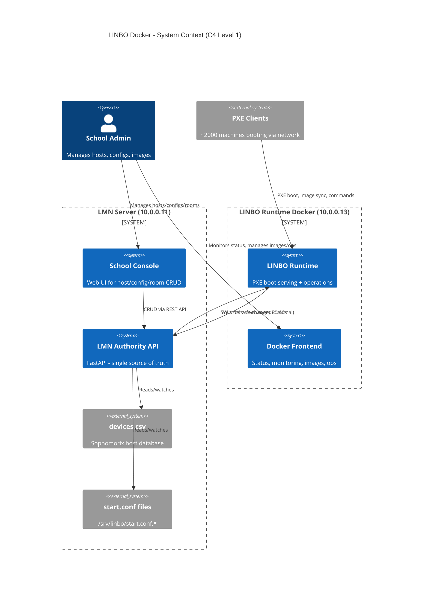

### 1.2 High-Level Component Interaction

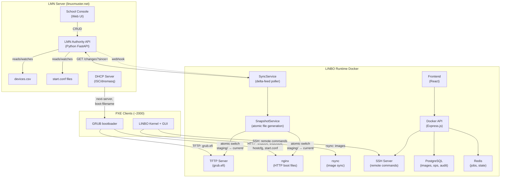

---

## 2. LMN Authority API Architecture

**Repository:** `amolani/lmn-linbo-authority-api`
**Runtime:** Python 3.11+ / FastAPI / uvicorn
**Location:** LMN Server (10.0.0.11)

### 2.1 Class Diagram

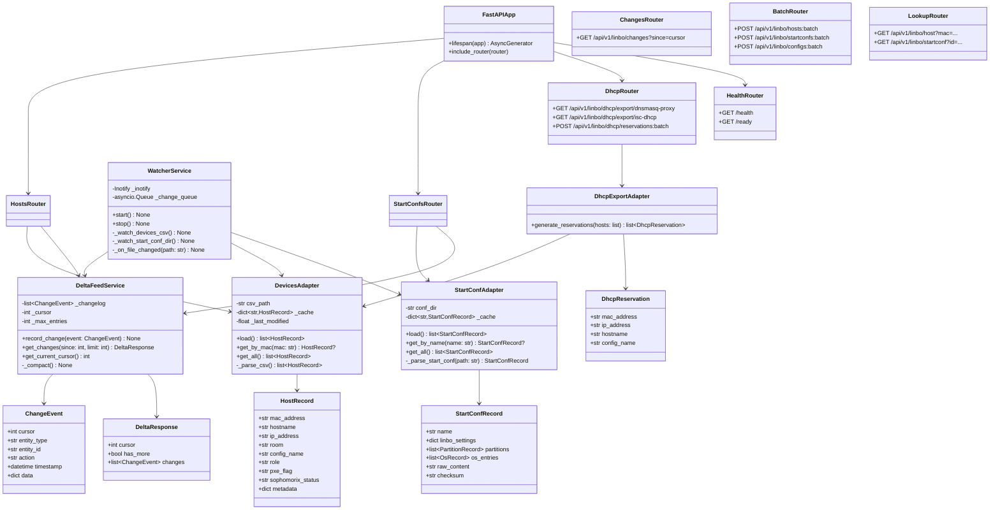

### 2.2 Internal Component Diagram

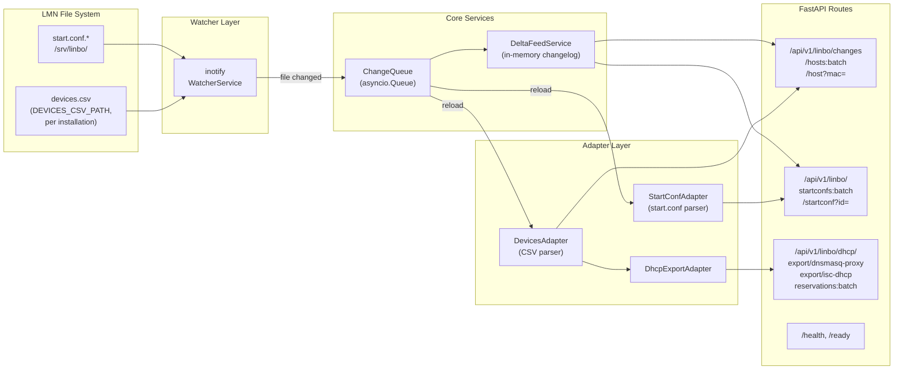

### 2.3 Delta-Feed Protocol

The delta-feed is the core synchronization mechanism. The Authority API maintains a changelog of all changes to hosts and start.conf files. The changelog is persisted (JSONL file or SQLite) so it survives API restarts.

```
GET /api/v1/linbo/changes?since=1708943200:40

Response:
{
  "nextCursor": "1708943200:42",
  "hostsChanged": ["AA:BB:CC:DD:EE:FF", "11:22:33:44:55:66"],
  "startConfsChanged": ["win11_efi_sata"],
  "configsChanged": ["win11_efi_sata"],
  "dhcpChanged": true,
  "deletedHosts": [],
  "deletedStartConfs": []
}
```

The Docker then fetches the changed data via batch endpoints:

```
POST /api/v1/linbo/hosts:batch
{ "macs": ["AA:BB:CC:DD:EE:FF", "11:22:33:44:55:66"] }

POST /api/v1/linbo/startconfs:batch
{ "ids": ["win11_efi_sata"] }
```

**Cursor semantics:**
- Cursor format: `"timestamp:sequence"` (monotonic, e.g., `"1708943200:42"`)
- `since` empty/null: Full dump (returns all MACs and startConf IDs for initial sync)
- `since=<cursor>`: Only changes since that cursor
- Compaction: Events older than 24h or beyond 10,000 entries are compacted; clients that fall behind get a full dump

**Restart behavior:**
- The changelog is persisted to disk (JSONL or SQLite), so API restarts do not lose history
- If the changelog is lost/corrupted, clients detect an invalid cursor and fall back to a full sync (`since` empty)

---

## 3. LINBO Runtime Docker Architecture

### 3.1 Service Classification: KEEP / REMOVE / NEW

```mermaid
classDiagram
    direction TB

    class SyncService {
        <<NEW>>
        -int pollIntervalSec
        -int cursor
        -string authorityUrl
        +start() void
        +stop() void
        +pollChanges() SyncResult
        +fullSync() SyncResult
        -_applyHostChanges(changes) void
        -_applyStartConfChanges(changes) void
    }

    class SnapshotService {
        <<NEW>>
        -string stagingDir
        -string currentDir
        +buildSnapshot(hosts, configs) void
        +switchSnapshot() void
        +rollback() void
        -_generateGrubConfigs(staging) void
        -_generateStartConfs(staging) void
        -_generateHostCfgs(staging) void
        -_atomicSwitch() void
    }

    class SnapshotGrubGenerator {
        <<NEW>>
        +generateMainGrub(hosts, configs) string
        +generateGroupGrub(config) string
        +generateHostSymlinks(hosts) void
    }

    class ImageService {
        <<KEEP>>
        +list() Image[]
        +get(id) Image
        +scan() ScanResult
        +delete(id) void
        +getInfo(filename) ImageInfo
    }

    class KernelService {
        <<KEEP>>
        +listKernels() Kernel[]
        +switchKernel(variant) void
        +getCurrentKernel() Kernel
    }

    class FirmwareService {
        <<KEEP>>
        +listFirmware() Firmware[]
        +searchFirmware(query) Firmware[]
        +addFirmware(files) void
    }

    class PatchclassService {
        <<KEEP>>
        +list() Patchclass[]
        +get(name) Patchclass
        +addDriver(patchclass, driver) void
        +removeDriver(patchclass, driver) void
    }

    class RemoteService {
        <<KEEP>>
        +sendCommand(hosts, command) Operation
        +reboot(hosts) Operation
        +shutdown(hosts) Operation
        +localBoot(hosts) Operation
    }

    class WolService {
        <<KEEP>>
        +wake(macAddresses) WolResult
        +wakeByRoom(roomName) WolResult
    }

    class GrubThemeService {
        <<KEEP>>
        +getThemeConfig() ThemeConfig
        +updateThemeConfig(config) ThemeConfig
        +uploadBackground(file) void
    }

    class LinbofsService {
        <<KEEP>>
        +getStatus() LinbofsStatus
        +rebuild() void
    }

    class SshService {
        <<KEEP>>
        +exec(host, command) SshResult
        +getKeys() SshKeys
    }

    class AuthService {
        <<KEEP>>
        +login(username, password) Token
        +verify(token) User
        +createApiKey(name) ApiKey
    }

    class OperationWorker {
        <<KEEP>>
        +startWorker() void
        +processJob(job) void
    }

    class HostService {
        <<REMOVE>>
        +list() Host[]
        +create(data) Host
        +update(id, data) Host
        +delete(id) void
    }

    class ConfigService {
        <<REMOVE>>
        +list() Config[]
        +create(data) Config
        +update(id, data) Config
        +delete(id) void
        +deploy(id) void
    }

    class RoomService {
        <<REMOVE>>
        +list() Room[]
        +create(data) Room
        +update(id, data) Room
        +delete(id) void
    }

    class DeviceImportService {
        <<REMOVE>>
        +importCsv(data) ImportResult
        +exportCsv() string
    }

    class ProvisioningService {
        <<REMOVE>>
        +provision(hosts) ProvisionResult
    }

    class MacctService {
        <<REMOVE>>
        +initializeConsumerGroup() void
    }

    class DhcpService {
        <<REMOVE>>
        +getNetworkSettings() NetworkSettings
        +generateConfig() DhcpConfig
    }

    SyncService --> SnapshotService : triggers build
    SnapshotService --> SnapshotGrubGenerator : generates GRUB
    RemoteService --> SshService : sends commands
    RemoteService --> OperationWorker : enqueues jobs
    WolService ..> RemoteService : wakes then commands
```

### 3.2 Container Architecture (Updated docker-compose)

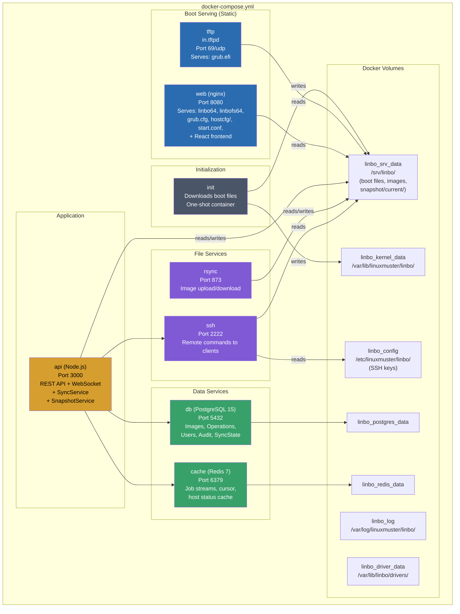

**Key change:** No new containers are needed. The `SyncService` and `SnapshotService` run inside the existing `api` container. The `web` (nginx) container serves snapshot files from the shared `linbo_srv_data` volume.

### 3.3 API Routes: KEEP vs REMOVE

| Current Route | Status | Reason |
|---|---|---|
| `POST /api/v1/auth/login` | **KEEP** | Local auth for Docker frontend |
| `GET /api/v1/hosts` | **KEEP (read-only)** | Shows synced host data (no CRUD) |
| `POST /api/v1/hosts` | **REMOVE** | CRUD moves to School Console |
| `PUT /api/v1/hosts/:id` | **REMOVE** | CRUD moves to School Console |
| `DELETE /api/v1/hosts/:id` | **REMOVE** | CRUD moves to School Console |
| `POST /api/v1/hosts/import` | **REMOVE** | Import moves to School Console |
| `GET /api/v1/configs` | **KEEP (read-only)** | Shows synced config data |
| `POST /api/v1/configs` | **REMOVE** | CRUD moves to School Console |
| `PUT /api/v1/configs/:id` | **REMOVE** | CRUD moves to School Console |
| `DELETE /api/v1/configs/:id` | **REMOVE** | CRUD moves to School Console |
| `GET /api/v1/rooms` | **KEEP (read-only)** | Shows synced room data |
| `POST /api/v1/rooms` | **REMOVE** | CRUD moves to School Console |
| `GET /api/v1/images/*` | **KEEP** | Image management stays local |
| `POST /api/v1/images/*` | **KEEP** | Image management stays local |
| `GET /api/v1/operations/*` | **KEEP** | Operations stay on Docker |
| `POST /api/v1/operations/*` | **KEEP** | Operations stay on Docker |
| `GET /api/v1/system/kernel/*` | **KEEP** | Kernel management |
| `GET /api/v1/system/firmware/*` | **KEEP** | Firmware management |
| `GET /api/v1/system/patchclass/*` | **KEEP** | Driver management |
| `GET /api/v1/system/grub-theme/*` | **KEEP** | GRUB theme |
| `GET /api/v1/dhcp/*` | **REMOVE** | DHCP config editing moves to LMN; Docker reads DHCP exports from snapshot (dnsmasq-proxy, isc-dhcp via LMN Authority API `/api/v1/linbo/dhcp/export/*`) |
| `POST /api/v1/internal/*` | **MODIFY** | Add sync webhook endpoint |
| **NEW** `GET /api/v1/sync/status` | **NEW** | Sync state & cursor info |
| **NEW** `POST /api/v1/sync/trigger` | **NEW** | Force immediate sync |
| **NEW** `POST /api/v1/internal/webhook` | **NEW** | Receive change notifications |

---

## 4. Data Flow Diagrams

### 4.1 Boot Chain (PXE Client Startup)

```mermaid
sequenceDiagram
    autonumber
    participant DHCP as DHCP Server<br/>(LMN or Docker)
    participant Client as PXE Client
    participant TFTP as TFTP Server<br/>(Docker)
    participant NGINX as nginx<br/>(Docker)
    participant Snapshot as Snapshot<br/>/srv/linbo/

    Note over Client: Machine powers on / WoL
    Client->>DHCP: DHCP Discover
    DHCP-->>Client: Offer (IP, next-server, boot-filename)

    rect rgb(40, 60, 80)
        Note over Client,TFTP: Stage 1: GRUB Bootloader (TFTP)
        Client->>TFTP: TFTP Request: boot/grub/grub.efi
        TFTP-->>Client: grub.efi (UEFI bootloader)
        Note over Client: GRUB starts with own network stack
    end

    rect rgb(40, 80, 60)
        Note over Client,NGINX: Stage 2: GRUB Config + Kernel (HTTP)
        Client->>NGINX: HTTP GET /boot/grub/grub.cfg
        NGINX->>Snapshot: Read snapshot/current/boot/grub/grub.cfg
        Snapshot-->>NGINX: grub.cfg (MAC-based routing)
        NGINX-->>Client: grub.cfg
        Note over Client: GRUB evaluates MAC → finds boot params
        Client->>NGINX: HTTP GET /linbo64 (kernel)
        NGINX-->>Client: linbo64 (~15MB)
        Client->>NGINX: HTTP GET /linbofs64 (initramfs)
        NGINX-->>Client: linbofs64 (~400MB)
        Note over Client: GRUB boots kernel<br/>(GRUB network stack gone)
    end

    rect rgb(80, 60, 40)
        Note over Client,Snapshot: Stage 3: LINBO Init (New Network)
        Note over Client: Kernel → init.sh → udevd
        Note over Client: udhcpc → new DHCP lease
        Client->>NGINX: rsync/HTTP: start.conf (via group= param)
        Snapshot->>NGINX: snapshot/current/start.conf.{group}
        NGINX-->>Client: start.conf
        Client->>NGINX: HTTP GET /linbo_gui64_7.tar.lz
        NGINX-->>Client: Qt GUI archive
        Note over Client: LINBO GUI starts → user selects action
    end
```

**Important: `server=` and `LINBOSERVER` resolution:**
- GRUB passes `server=<ip>` as kernel cmdline parameter (from grub.cfg or hostcfg)
- LINBO init.sh also reads `LINBOSERVER` from DHCP Option 54 (Server Identifier)
- `server=` in start.conf `[LINBO]` section is overridden by the kernel cmdline `server=`
- **Consistency requirement:** The `server=` in GRUB configs (snapshot) and `Server =` in start.conf must both point to the Docker Runtime IP (e.g., 10.0.0.1), NOT the LMN server (10.0.0.11)
- The LMN Authority API's StartConfAdapter should validate/rewrite `Server =` in start.conf to match `LINBO_SERVER_IP` during snapshot generation
- In proxy-DHCP setups, DHCP Option 54 naturally resolves to the Docker/LINBO server IP

### 4.2 Sync Chain (Authority API → Docker Snapshot)

```mermaid
sequenceDiagram
    autonumber
    participant Timer as SyncService<br/>(30-60s interval)
    participant Auth as LMN Authority API
    participant Snap as SnapshotService
    participant Staging as staging/<br/>(temp directory)
    participant Current as current/<br/>(live directory)
    participant Redis as Redis Cache
    participant WS as WebSocket<br/>(frontend clients)

    Note over Timer: Poll timer fires (or webhook received)
    Timer->>Redis: GET sync:cursor
    Redis-->>Timer: cursor = 41

    Timer->>Auth: GET /api/v1/linbo/changes?since=1708943200:41
    Auth-->>Timer: {nextCursor: "1708943200:47", hostsChanged: [...], ...}

    alt has changes
        Timer->>Snap: buildSnapshot(changes)

        rect rgb(40, 60, 80)
            Note over Snap,Staging: Build in staging directory
            Snap->>Staging: Apply host upserts/deletes
            Snap->>Staging: Apply startconf upserts/deletes
            Snap->>Staging: Generate GRUB configs (main + group)
            Snap->>Staging: Generate host symlinks (MAC → group)
            Snap->>Staging: Copy start.conf files
            Snap->>Snap: Validate snapshot integrity
        end

        rect rgb(60, 80, 40)
            Note over Snap,Current: Atomic switch
            Snap->>Current: rename staging/ → current/<br/>(atomic on same filesystem)
            Note over Current: Boot files now serve new data
        end

        Snap->>Redis: SET sync:cursor = 47
        Snap->>WS: broadcast("sync", {cursor: 47, changes: 6})
        Timer->>Timer: Update local DB (hosts table, read-only copy)
    else no changes
        Note over Timer: Sleep until next poll
    end
```

### 4.3 Operation Chain (linbo-remote, WoL, Reboot)

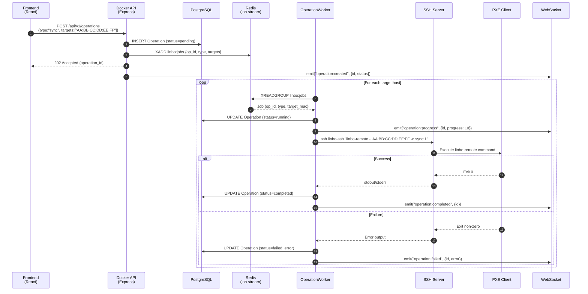

### 4.4 Image Upload Chain (PXE Client → Docker)

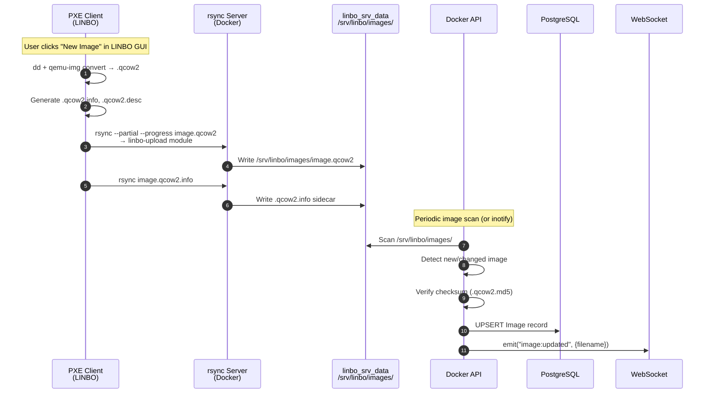

### 4.5 Webhook Notification (Optional Fast Path)

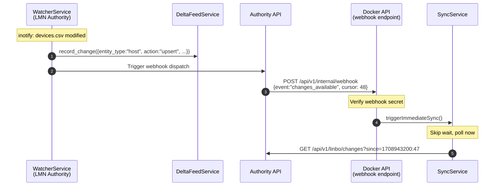

---

## 5. Snapshot File Structure

The snapshot system uses an atomic directory-switch pattern. Boot-serving containers (TFTP, nginx) always read from `current/`, which is a symlink to an immutable snapshot directory.

```
/srv/linbo/
├── snapshot/
│   ├── current -> ./snap-20260226T100000Z/     # Atomic symlink (live)
│   ├── previous -> ./snap-20260226T093000Z/    # Rollback target
│   │
│   ├── snap-20260226T100000Z/                  # Immutable snapshot
│   │   ├── boot/
│   │   │   └── grub/
│   │   │       ├── grub.cfg                    # Main GRUB (MAC routing)
│   │   │       ├── win11-uefi.cfg              # Group config
│   │   │       ├── ubuntu-2204.cfg             # Group config
│   │   │       ├── dual-uefi.cfg               # Group config
│   │   │       └── hostcfg/
│   │   │           ├── pc-r101-01.cfg -> ../win11-uefi.cfg
│   │   │           ├── pc-r101-02.cfg -> ../win11-uefi.cfg
│   │   │           ├── pc-r201-01.cfg -> ../ubuntu-2204.cfg
│   │   │           └── ...                     # One symlink per host
│   │   ├── start.conf.win11-uefi              # Generated start.conf
│   │   ├── start.conf.ubuntu-2204             # Generated start.conf
│   │   ├── start.conf.dual-uefi              # Generated start.conf
│   │   └── manifest.json                      # Snapshot metadata
│   │
│   ├── snap-20260226T093000Z/                  # Previous snapshot
│   │   └── ...
│   │
│   └── staging/                                # Build area (not served)
│       └── ...                                 # In-progress snapshot
│
├── linbo64                                     # Kernel (not in snapshot)
├── linbofs64                                   # Initramfs (not in snapshot)
├── linbo_gui64_7.tar.lz                        # GUI archive
├── images/                                     # QCOW2 images (not in snapshot)
│   ├── win11-base.qcow2
│   ├── win11-base.qcow2.info
│   ├── win11-base.qcow2.desc
│   ├── win11-base.qcow2.md5
│   ├── ubuntu-2204.qcow2
│   └── ...
└── icons/                                      # OS icons for LINBO GUI
    ├── ubuntu.svg
    ├── win10.svg
    └── ...
```

### 5.1 manifest.json

Each snapshot contains a manifest for auditability and rollback:

```json
{
  "version": 1,
  "created_at": "2026-02-26T10:00:00Z",
  "cursor": 47,
  "authority_url": "http://10.0.0.11:8000",
  "host_count": 2000,
  "config_count": 5,
  "grub_configs": ["grub.cfg", "win11-uefi.cfg", "ubuntu-2204.cfg", "dual-uefi.cfg"],
  "start_confs": ["start.conf.win11-uefi", "start.conf.ubuntu-2204", "start.conf.dual-uefi"],
  "checksum": "sha256:abc123..."
}
```

### 5.2 nginx Configuration for Snapshots

```nginx
# Boot files served from snapshot/current/
location /boot/ {
    alias /srv/linbo/snapshot/current/boot/;
    expires -1;                    # No caching during boot storms
    add_header X-Snapshot-Dir $upstream_http_x_snapshot;
}

# start.conf files from snapshot
location ~ ^/start\.conf\. {
    root /srv/linbo/snapshot/current/;
    expires -1;
}

# Static boot files (kernel, initramfs - not in snapshot)
location /linbo64  { alias /srv/linbo/linbo64; }
location /linbofs64 { alias /srv/linbo/linbofs64; }
```

---

## 6. Data Models

### 6.1 LMN Authority API Models

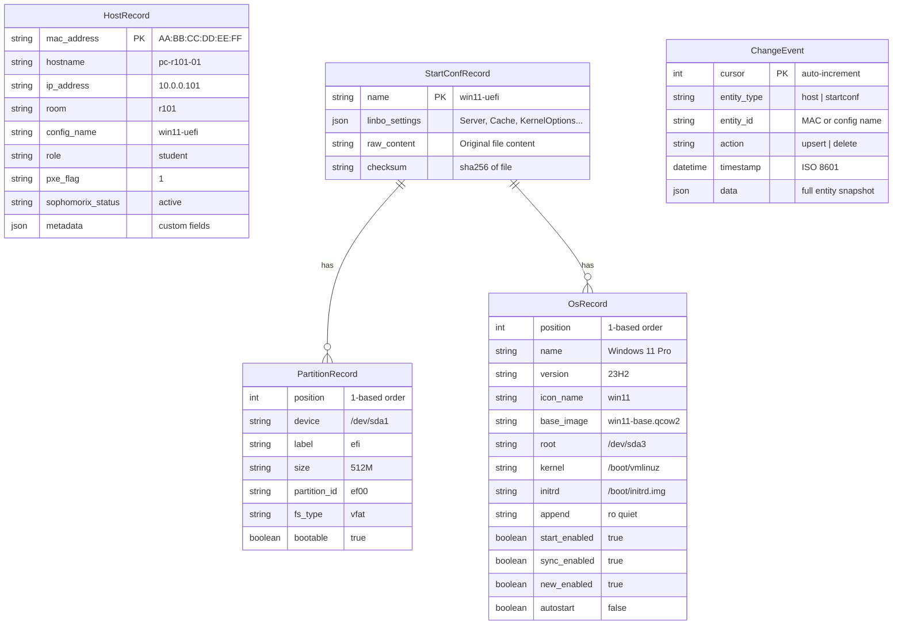

### 6.2 Docker Runtime Models (Prisma DB - What Stays)

After restructuring, the PostgreSQL database retains only **runtime-local** data. Host and Config tables become read-only caches populated by SyncService.

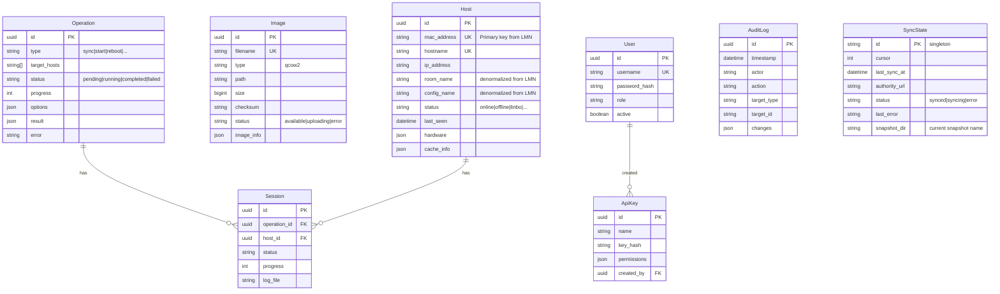

**Removed from Prisma schema:**
- `Room` model (rooms derived from host data)
- `Config` model (configs come from start.conf files via snapshot)
- `ConfigPartition` model
- `ConfigOs` model
- Host write operations (create/update/delete)

**Added to Prisma schema:**
- `SyncState` model (cursor tracking, sync status)

### 6.3 Snapshot State

The `SyncState` singleton tracks the synchronization cursor and snapshot metadata:

```json
{
  "id": "singleton",
  "cursor": 47,
  "last_sync_at": "2026-02-26T10:00:00Z",
  "authority_url": "http://10.0.0.11:8000",
  "status": "synced",
  "last_error": null,
  "snapshot_dir": "snap-20260226T100000Z"
}
```

Stored in both PostgreSQL (persistent) and Redis (fast access):
- **Redis key:** `sync:state` (JSON, updated every poll cycle)
- **PostgreSQL:** `SyncState` table (persisted, survives Redis flush)

---

## 7. Security Model

### 7.1 Authentication Between Components

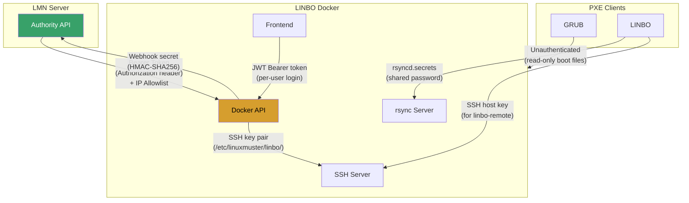

### 7.2 Security Boundaries

| Boundary | Authentication | Authorization | Encryption |
|---|---|---|---|
| Admin → Frontend | JWT (username/password) | Role-based (admin/viewer) | HTTPS (reverse proxy) |
| Frontend → Docker API | JWT Bearer token | Middleware check per route | HTTPS (reverse proxy) |
| Docker API → Authority API | Bearer Token + IP Allowlist | Read-only scope | HTTPS recommended |
| Authority API → Docker webhook | HMAC-SHA256 signature | Webhook secret validation | HTTPS recommended |
| PXE Client → TFTP | None (read-only) | N/A | None (TFTP limitation) |
| PXE Client → HTTP boot | None (read-only) | N/A | None (PXE limitation) |
| PXE Client → rsync | rsyncd.secrets | Module-level ACL | None (rsync limitation) |
| Docker API → SSH Server | SSH key pair | Root on SSH container | SSH encryption |

### 7.3 Secrets Management

| Secret | Location | Rotation |
|---|---|---|
| `JWT_SECRET` | `.env` on Docker host | Manual, restart required |
| `AUTHORITY_BEARER_TOKEN` | `.env` on Docker host + Authority API config | Manual, coordinated |
| `WEBHOOK_SECRET` | `.env` on both servers | Manual, coordinated |
| `DB_PASSWORD` | `.env` on Docker host | Manual, restart required |
| SSH host keys | `linbo_config` volume | Generated on first boot |
| rsync secrets | `config/rsyncd.secrets` | Manual |

---

## 8. Scalability Considerations

### 8.1 Boot Storm Handling (~2000 Clients)

A "boot storm" occurs when many machines power on simultaneously (e.g., start of school day). The architecture handles this through static file serving:

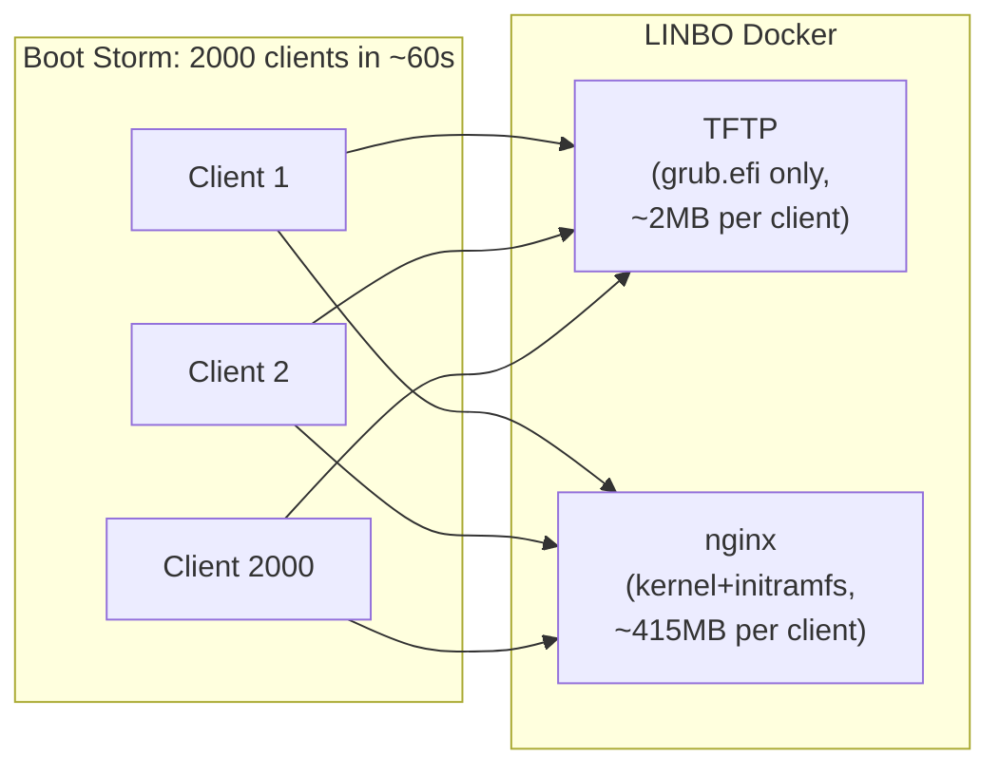

**Why this scales:**

| Concern | Current (DB queries) | New (Snapshot) |
|---|---|---|
| GRUB config per client | DB query → generate → serve | Static file read (nginx) |
| start.conf per client | DB query → generate → serve | Static file read (nginx) |
| Host config lookup | DB query by MAC | Symlink dereference (filesystem) |
| Bottleneck | PostgreSQL connections | Disk I/O + network bandwidth |
| Concurrent capacity | ~50-100 (DB pool) | ~2000+ (nginx worker_connections) |

### 8.2 Resource Estimates

| Resource | Boot Storm (2000 clients) | Steady State |
|---|---|---|
| TFTP bandwidth | 2000 x 2MB = 4GB burst | Negligible |
| HTTP bandwidth | 2000 x 415MB = ~800GB total | Negligible |
| Duration (1Gbps) | ~107 min theoretical; staggered boot + client-side cache reduces effective load | N/A |
| Duration (10Gbps) | ~11 min theoretical; with staggered boot + linbofs caching ~5-7 min practical | N/A |
| **Note** | Real-world: not all 2000 clients cold-boot simultaneously. linbofs64 is cached locally after first boot. Typical burst is 100-300 concurrent, not 2000. | |
| nginx connections | Up to 2000 concurrent | 0-5 |
| PostgreSQL connections | 0 (no DB during boot) | 5-10 |
| Redis operations | 0 (no cache during boot) | ~10/min |
| Disk IOPS | High (sequential reads) | Low |

### 8.3 Snapshot Switching During Boot Storm

The atomic symlink switch ensures no client ever sees a half-updated state:

```
# Atomic operation (single rename syscall)
# Even during 2000 concurrent reads, this is safe

staging/  ← build complete, validated
current -> snap-20260226T093000Z  ← currently being read by clients

# Switch:
rename("staging/", "snap-20260226T100000Z/")
symlink("snap-20260226T100000Z/", "current.new")
rename("current.new", "current")  ← atomic on Linux

# Result:
# - Clients mid-read: finish with old snapshot (file handles still open)
# - New clients: get new snapshot
# - No partial states ever visible
```

### 8.4 Multi-Node Deployment (Future)

For schools with multiple LINBO Docker instances (e.g., per building):

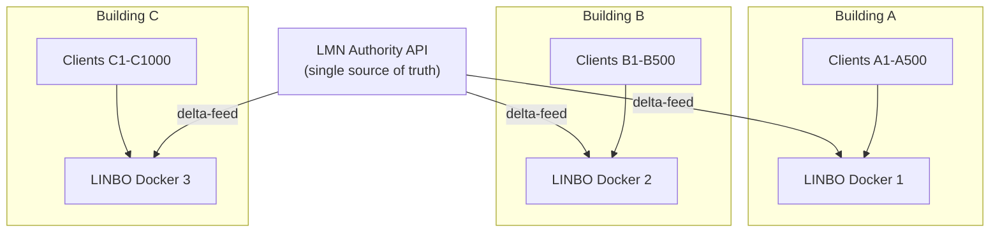

Each Docker instance independently polls the Authority API and maintains its own snapshot. This provides:
- **Geographic distribution:** Boot files served locally per building
- **Fault isolation:** One Docker down does not affect others
- **Bandwidth optimization:** Only delta changes flow over WAN
- **Independent operation:** Each Docker can serve cached snapshots even if Authority API is unreachable

---

## Appendix A: Migration Path from Current to New Architecture

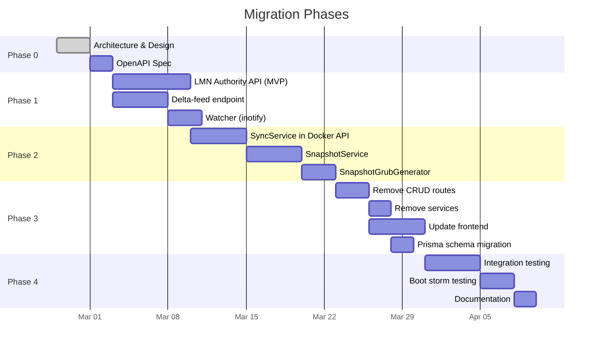

## Appendix B: Configuration Variables

### New Environment Variables for Docker API

| Variable | Default | Description |
|---|---|---|
| `AUTHORITY_API_URL` | `http://10.0.0.11:8000` | LMN Authority API base URL |
| `AUTHORITY_BEARER_TOKEN` | (required) | Bearer token for Authority API |
| `SYNC_POLL_INTERVAL_SEC` | `30` | Delta-feed poll interval |
| `SYNC_FULL_INTERVAL_SEC` | `3600` | Full sync interval (fallback) |
| `WEBHOOK_SECRET` | (optional) | HMAC secret for webhook verification |
| `SNAPSHOT_DIR` | `/srv/linbo/snapshot` | Snapshot base directory |
| `SNAPSHOT_MAX_KEEP` | `3` | Number of old snapshots to retain |

### New Environment Variables for LMN Authority API

| Variable | Default | Description |
|---|---|---|
| `DEVICES_CSV_PATH` | (required, no default) | Path to devices.csv. Typical: `/etc/linuxmuster/sophomorix/default-school/devices/devices.csv`. Varies per installation — must be configured explicitly. |
| `START_CONF_DIR` | `/srv/linbo/` | Directory containing start.conf files |
| `BEARER_TOKENS` | (required) | Comma-separated list of valid Bearer tokens |
| `IP_ALLOWLIST` | `10.0.0.0/16` | Comma-separated CIDRs for IP allowlist |
| `WEBHOOK_TARGETS` | (optional) | Comma-separated list of Docker webhook URLs |
| `WEBHOOK_SECRET` | (optional) | HMAC secret for webhooks |
| `DELTA_MAX_ENTRIES` | `10000` | Max changelog entries before compaction |
| `LISTEN_HOST` | `0.0.0.0` | Bind address |
| `LISTEN_PORT` | `8000` | Listen port |
